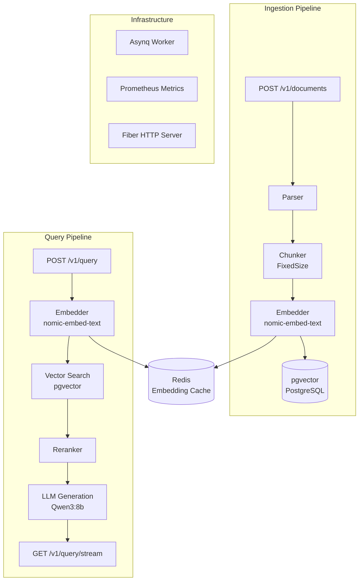

# ragnar

> A production-grade RAG engine built in Go - document ingestions, vector search, and streaming LLM generation. No frameworks, no LangChain, just pure engineering.


---

## Overview

**ragnar** is a self-contained RAG (Retrieval-Augmented Generation) pipeline engine designed for production use. It implements two fully decoupled pipelines - **Ingestion** and **Query** - backed by a distributed async worker architecture, vector similarity search, and real-time streaming generation.

Built from scratch without LangChain or any high-level AI framework. Every component is explicit, observable, and replaceable.

---

## Architecture



---

## Features

- **Dual pipeline architecture** - fully decoupled ingestion and query pipelines
- **Async document processing** - Async-backed worker queue for non-blocking ingestion
- **Vector similarity search** - pgvector with cosine similarity, configurable score threshold
- **Embedding cache** - Redis decorator patter to avoid redundant embedding calls
- **Streaming generation** - NDJSON streaming via `GET /v1/query/stream` for real-time responses
- **Provider abstraction** - swappable LLM and embedder backends (Ollama / OpenAI-compatible)
- **Observability** - Prometheus metrics exposed on `/metrics`
- **Fully containerized** - single `docker compose up` to run the entire stack

---

## Tech Stack

| Component        | Technology            | Reason                                                        |
| ---------------- | --------------------- | ------------------------------------------------------------- |
| Language         | Go 1.26.3             | Concurrency primitives, low overhead, great for pipeline work |
| HTTP Server      | Fiber                 | Fast, minimal, expressive routing                             |
| Vector Store     | PostgreSQL + pgvector | Battle-tested persistence with native vector ops              |
| Embedding Cache  | Redis                 | Sub-millisecond cache lookups, avoids redundant embed calls   |
| Task Queue       | Asynq                 | Redis-backed distributed worker queue                         |
| LLM Runtime      | Ollama                | Local inference, zero cost, GPU offloading                    |
| LLM Model        | Qwen3:8b              | Capable instruction-following, fits in 8GB VRAM               |
| Embed Model      | nomic-embed-text      | High-quality embeddings, fast on CPU                          |
| Observability    | Prometheus            | Standard metrics scraping                                     |
| Containerization | Docker Compose        | One-command local stack                                       |

---

## Getting Started

### Prerequisites

- Docker & Docker Compose
- Ollama running locally with models pulled:

```bash
ollama pull qwen3:8b
ollama pull nomic-embed-text
```

### Run

```bash
git clone https://github.com/Xenn-00/ragnar.git
cd ragnar
cp .env.example .env
docker compose up --build
```

The API server will be available at `http://localhost:8080`.

---

## API Reference

### Documents

| Method   | Endpoint            | Description                      |
| -------- | ------------------- | -------------------------------- |
| `POST`   | `/v1/documents`     | Ingest a new document (async)    |
| `GET`    | `/v1/documents/:id` | Get document status and metadata |
| `DELETE` | `/v1/documents/:id` | Delete a document and its chunks |

#### POST /v1/documents

```json
{
  "title": "Go Concurrency Patterns",
  "content": "..."
}
```

```json
{
  "document_id": "uuid",
  "status": "queued"
}
```

### Query

| Method | Endpoint              | Description                               |
| ------ | --------------------- | ----------------------------------------- |
| `POST` | `/v1/query`           | Submit a query (async, returns query ID)  |
| `GET`  | `/v1/query/stream?q=` | Stream LLM response in real-time (NDJSON) |

#### GET /v1/query/stream?q=your+question

```
data: {"token": "The"}
data: {"token": " answer"}
data: {"token": " is"}
...
data: [DONE]
```

---

## Design Decisions

### Why no LangChain?

LangChain (and its Go equivalents) abstract away the mechanics of embedding, chunking, and retrieval behind opaque chains. Building without it forces every design decision to be explicit - chunk size, similarity threshold, reranking strategy, cache invalidation - and makes the system observable and debuggable.

### Why Asynq for ingestion?

Document ingestion is inherently slow: parsing, chunking, N embedding calls, and bulk vector inserts. Decoupling ingestion from the HTTP response via Asynq means the API is non-blocking and ingestion can be retried independently on failure.

### Why Redis as an embedding cache?

Embeddings for the same text chunk are deterministic. Caching them in Redis with a content-hash key eliminates redundant Ollama calls during re-ingestion or duplicate content — reducing latency and model load significantly.

### Why pgvector over a dedicated vector DB?

A dedicated vector database (Qdrant, Weaviate) adds operational complexity with limited benefit at this scale. pgvector co-locates vector search with relational metadata in a single PostgreSQL instance, simplifying transactions, backups, and deployment.

### Similarity threshold

Default minimum score is `0.3` (cosine similarity). The `ivfflat` index is intentionally disabled until the dataset exceeds 1,000 vectors — below that threshold, sequential scan outperforms approximate index lookup.

---

## Project Structure

```
ragnar/
├── cmd/
│   ├── server/         # Fiber HTTP server entrypoint
│   └── worker/         # Asynq worker entrypoint
├── internal/
│   ├── config/         # Environment configuration
│   ├── store/          # PostgreSQL (pgxpool + SendBatch)
│   ├── cache/          # Redis client
│   ├── ingestion/      # Parser + FixedSize chunker
│   ├── retrieval/      # Vector search + reranker
│   ├── generation/     # LLM generation
│   ├── pipeline/       # Ingestion & query pipeline orchestration
│   ├── metrics/        # Prometheus metrics
│   └── provider/
│       ├── embedder/   # Embedder abstraction + Redis cache decorator
│       └── llm/        # LLM abstraction + NDJSON streaming
└── pkg/
    └── task/           # Asynq task definitions
```

---

## Roadmap

- [✅] Semantic chunking (sentence-boundary aware)
- [ ] Rate limiting
- [ ] `/metrics` endpoint on worker
- [ ] `ivfflat` index activation at scale
- [ ] OpenAI-compatible provider swap

---

## License

MIT © [Xenn-00](https://github.com/Xenn-00/ragnar/blob/main/LICENSE)
